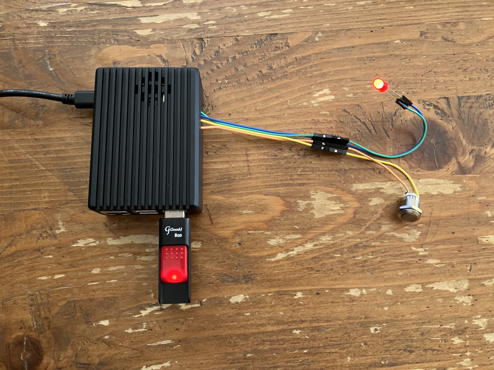

# Raspberry Pi USB Drive Auto Formatter

A headless, fully automated USB formatting system for Raspberry Pi. It detects USB insertion, waits for a hardware button hold, and automatically formats the drive to FAT32 while providing LED status feedback.

## Features
* **Plug & Play Detection**: Uses `udev` to instantly detect USB insertion.
* **Hardware Safety Lock**: Requires a 3-second button hold to prevent accidental data loss.
* **Visual Feedback**: LED indicators for standby, formatting, and completion states.
* **Safe Removal**: Handles physical disconnection gracefully with `systemd` signal handling.

## Hardware Requirements
* Raspberry Pi (Tested on Raspberry Pi OS)
* 1x Push Button (Momentary)
* 1x LED (with built-in resistor, 3.3V compatible)
* Jumper Wires

## Wiring (GPIO)
* **LED (+)**: GPIO 17 (Pin 11)
* **LED (-)**: GND (Pin 6)
* **Button**: GPIO 22 (Pin 15)
* **Button**: GND (Pin 14)

## Installation
1. Copy `format_usb.py` to `/usr/local/bin/` and make it executable.
2. Copy the systemd service file to `/etc/systemd/system/usb-format@.service`.
3. Add the udev rule to `/etc/udev/rules.d/99-usb-format.rules`.
4. Reload daemons: `sudo systemctl daemon-reload` and `sudo udevadm control --reload-rules`.

## ⚠️ WARNING
This system will permanently wipe all data on the inserted USB drive. Use at your own risk. The author is not responsible for any accidental data loss.
